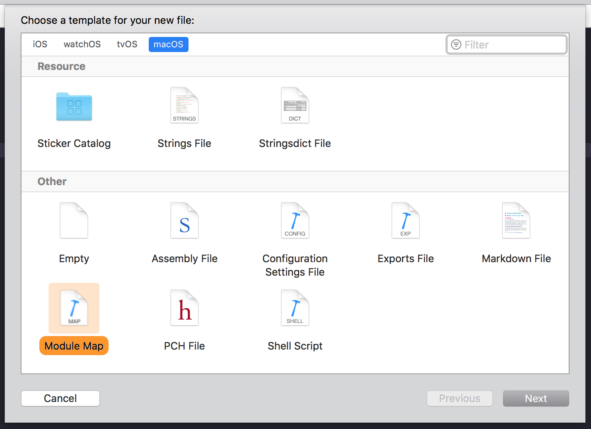

# ModuleMap.xctemplate
An Xcode file template for a `.modulemap` file.

## Installation

1. Make sure you have the `Templates/Other/` directory in your home
    ```
    mkdir -p ~/Library/Developer/Xcode/Templates/Other/
    ```
2. Copy the `Module Map.xctemplate` folder there.
    ```
    cp 'Module Map.xctemplate' ~/Library/Developer/Xcode/Templates/Other/
    ```

### Looks like


### Generated source file example
```
//
//  MyModule.modulemap
//  MyModule
//
//  Created by 0bmxa on 30.04.2018.
//  Copyright © 2018 0bmxa. All rights reserved.
//

framework module MyModule {
    umbrella header "MyModule.h"

    export *
    module * { export * }

    // requires objc
}

/*
module MyModule.Swift {
    header "MyModule-Swift.h"
    requires objc
}
*/

/*
module MyModule.__Swift {
    exclude header "MyModule-Swift.h"
}
*/
```
